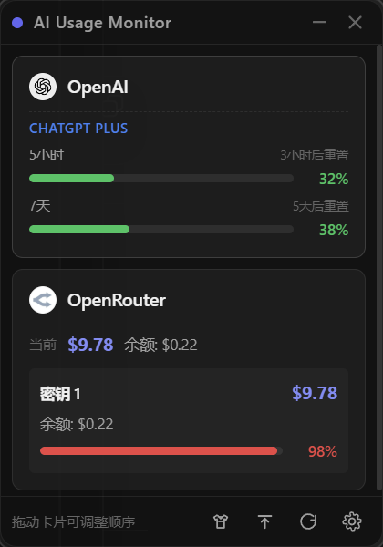
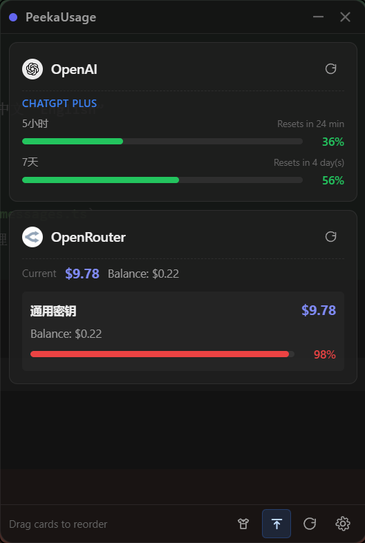
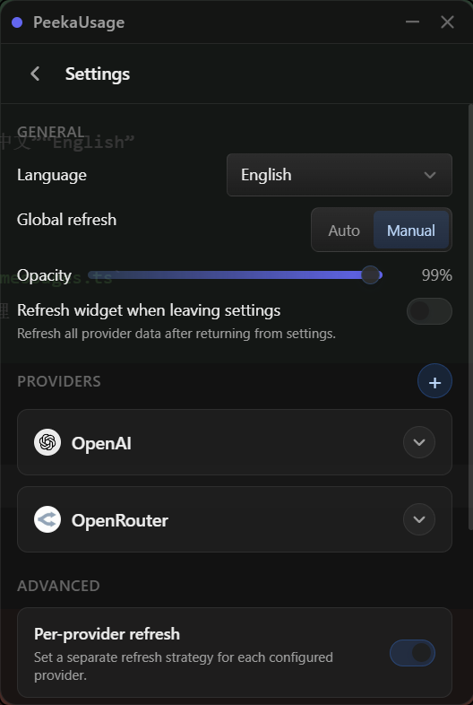
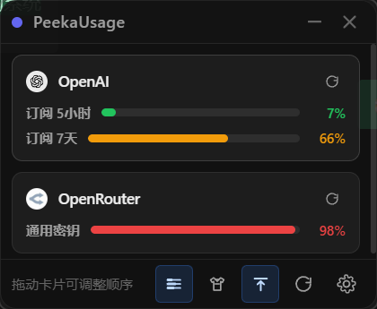

# PeekaUsage

[中文 README](./README.md)

A small desktop widget that tries to ease AI token anxiety. Well, not really fix it.

<p align="center">
  
  
  
  
</p>

If you are also juggling Anthropic and OpenAI subscriptions for tools like Claude Code, Codex, or Openclaw, you probably know the feeling: after running for a while, you want to see how much quota is gone, and you end up repeatedly opening the CLI for `/usage` or `/status`, or checking a dashboard again and again.

Sometimes you also have to buy extra API credits just to keep going. If your company is not paying for it, that cost is painful. This project pins those numbers to the corner of your desktop so checking them takes less effort and hurts a little less.

It stays in the corner of your desktop and makes it easy to glance at how much OpenAI, Anthropic, and OpenRouter usage you have left.

## What It Does

- Tracks usage-based spending, budgets, balances, and rate limits for OpenAI, Anthropic, and OpenRouter
- Shows subscription usage windows for OpenAI and Anthropic
- Auto-detects OAuth tokens from local Claude Code and Codex CLI credentials, and links to the official auth guides
- Lets each provider store multiple named API keys, validate them, clear them, and switch the active system environment variable with one click
- Supports widget-wide manual refresh, per-card refresh, and tray refresh
- Supports auto refresh and manual-only mode, with intervals configurable in seconds or minutes
- Supports provider-specific polling overrides
- Supports drag-and-drop card ordering with persistence
- Supports detailed and compact widget display modes
- Supports light, dark, and system themes, always-on-top mode, and window opacity control
- Supports instant language switching between Simplified Chinese, Traditional Chinese, and English
- Supports tray actions for show, hide, refresh, and opening settings

## Platform Notes

- Windows
- Linux
- macOS

## Why Not Every Provider Is Supported Yet

Because I am lazy, honestly. And some providers simply do not expose an official API for this.

If you use a provider that is still missing, PRs are welcome. The most helpful contributions usually include:

- Rust-side provider implementation and type updates
- Frontend settings and card display support
- Matching docs, environment variables, icons, and verification notes

If the data source is trustworthy, the behavior is clear, and the change does not break the existing UX, I am very happy to merge it.

## Quick Start

### 1. Install dependencies

```bash
npm install
```

### 2. Extra Linux dependencies

If you are developing or packaging on Ubuntu / Debian, install these first:

```bash
sudo apt-get update
sudo apt-get install -y build-essential curl file libfuse2 libgtk-3-dev libssl-dev libwebkit2gtk-4.1-dev libayatana-appindicator3-dev librsvg2-dev patchelf
```

### 3. macOS build note

- macOS `app` / `dmg` bundles must be built on a Mac
- GitHub Actions is set up to produce both `x86_64` and `arm64` macOS bundles
- The project is not signed or notarized yet, so first launch may require manual approval

If macOS says the app is damaged and cannot be opened after installation, run this in Terminal:

```bash
xattr -dr com.apple.quarantine <drag your app here>
```

The final command usually looks like this:

```bash
xattr -dr com.apple.quarantine /Applications/PeekaUsage.app
```

### 4. Start the frontend

```bash
npm run dev
```

### 5. Run the desktop app

```bash
npm run tauri dev
```

### 6. Run checks

```bash
npx tsc --noEmit
cargo check
```

If `cargo` is not in your PATH, add your Rust toolchain first.

## Credentials

### API Keys

You can either save them in the settings UI or provide them with environment variables.

| Provider | Environment Variable |
| --- | --- |
| OpenAI | `OPENAI_API_KEY` |
| Anthropic | `ANTHROPIC_API_KEY` |
| OpenRouter | `OPENROUTER_API_KEY` |

Notes:

- Anthropic cost reporting requires an Admin Key
- Environment variables take precedence over saved settings

### OAuth Tokens

Subscription usage is auto-detected from local tool credentials when possible.

Note: Anthropic subscription usage should not be queried too frequently, or it may return HTTP 429.

| Source | File Path | Field |
| --- | --- | --- |
| Claude Code | `~/.claude/.credentials.json` | `claudeAiOauth.accessToken` |
| Codex CLI | `~/.codex/auth.json` | `tokens.access_token` |

Notes:

- OpenAI `tokens.access_token` supports both string and indexed-object formats
- OpenRouter does not currently provide subscription OAuth usage here

## Project Layout

```text
src/
  components/
  composables/
  stores/
  utils/

src-tauri/src/
  commands/
  config/
  providers/
  tray/
```

## License

[MIT](./LICENSE)

